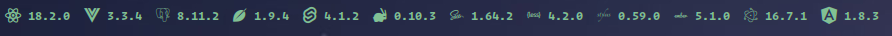

# Script for polybar to get npm packages

This script displays the current selected npm packages. Information is obtained from npm official api.



# Python Dependencies

-   `argparser`
-   `requests`
-   `configparser`

# Usage

Move `pnpm.py` and `pnpm.config` to specific folder and create polybar module or use `install.sh` script.

Provide your package names in the `-fws` argument to the script like:
`python3 /path/to/pnpm.py -fws react angular ...`

# Polybar

You just need to import module ( if you installed it from script or manually as file ):

-   go to your polybar conf file with the `bars`
-   use `include-file` on the top of file
-   `include-file = path/to/your/module/or/modules/file`

or create module in the exist file:

```
[module/pnpm]
type = custom/script
exec = python3 ~/.config/polybar/pnpm/pnpm.py -fws react
interval = 300
tail = true
```

and import font to the polybar bar:

`font-0 = "Terminess Nerd Font Mono:size=20;5"`
in this case `font-0` current `0` is a font priority, and `size=20` size for current font

# Config

Exist config has predefined options:

-   react
-   vue
-   leaflet
-   graphql
-   pg
-   amqplib
-   sass
-   less
-   stylus
-   ember-cli
-   svelte
-   electron
-   angular

You can use these options, or create your own, just add a section to the `pnpm.config` like this:

```
[FRAMEWORK_NAME]
name = FRAMEWORK_NPM_NAME
icon = FRAMEWORK_ICON
```
